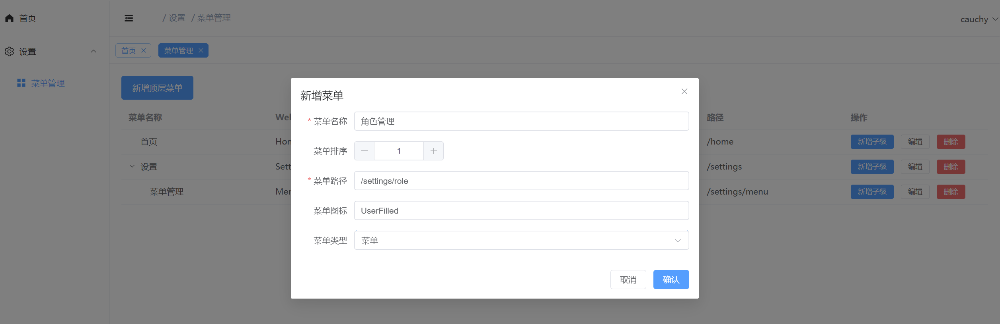
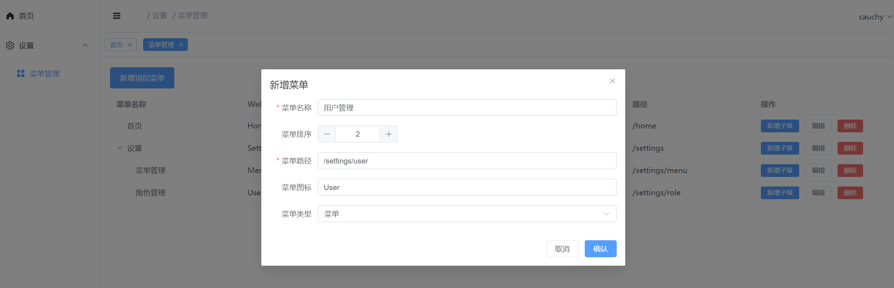
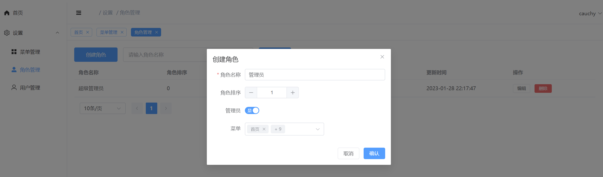
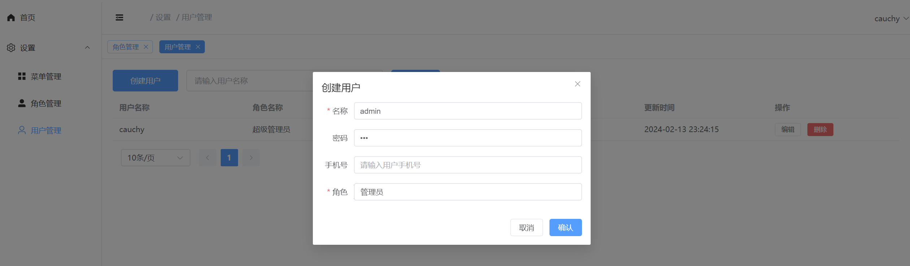

## 前端

### 项目运行

- 修改配置文件

    - `vite.config.ts`: host 修改为实际运行环境 ip 
    - `.env.development`: VITE_APP_BASE_URL 修改为实际访问路由

直接执行下述命令拉起前端界面：

```
npm install
npm run dev
```

### 项目使用示例

- 新增设置下的二级菜单：角色管理



- 新增设置下的二级菜单：用户管理



- 角色管理界面，创建管理员角色



- 用户管理界面，创建用户，分配管理员角色




### 项目须知

- 创建菜单，左侧导航栏需要用户退出重登才可显示
- 创建角色、用户，可能需要刷新页面才能正常展示
- 菜单图标：[element-icon](https://element-plus.org/zh-CN/component/icon.html#icon-collection:~:text=Copy%20icon%20code-,System,-Plus) 自行获取